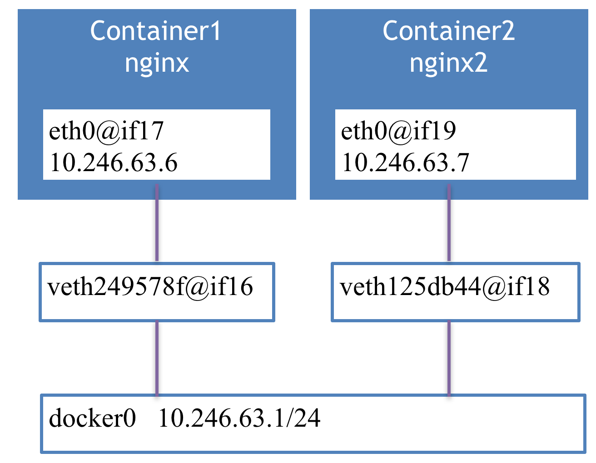

# Docker Networking

when we run

    docker run -d -P --net=bridge --name nginx nginx:1.9.1

Docker use bridge network, which is also the default network.
We can check docker with following command.

    ip addr show docker0

The docker0 in this case is `10.246.63.1/24`

    5: docker0: <BROADCAST,MULTICAST,UP,LOWER_UP> mtu 1472 qdisc noqueue state UP group default
        link/ether 02:42:ea:a3:34:8c brd ff:ff:ff:ff:ff:ff
        inet 10.246.63.1/24 scope global docker0
           valid_lft forever preferred_lft forever
        inet6 fe80::42:eaff:fea3:348c/64 scope link
           valid_lft forever preferred_lft forever

If we check how eth0 is, in the container

    [root@node-1 ~]# docker exec nginx ip addr show eth0

It will output like following, `16` and `if17`.

    16: eth0@if17: <BROADCAST,MULTICAST,UP,LOWER_UP> mtu 1472 qdisc noqueue state UP group default
        link/ether 02:42:0a:f6:3f:06 brd ff:ff:ff:ff:ff:ff
        inet 10.246.63.6/24 scope global eth0
           valid_lft forever preferred_lft forever
        inet6 fe80::42:aff:fef6:3f06/64 scope link
           valid_lft forever preferred_lft forever

We can check the device on host machine.

    ip addr show $(ip addr | grep if16 | awk '{print $2}' | awk -F"@" '{print $1}')

We will get result like this.

    17: veth249578f@if16: <BROADCAST,MULTICAST,UP,LOWER_UP> mtu 1472 qdisc noqueue master docker0 state UP group default
        link/ether e6:63:5a:7f:aa:9e brd ff:ff:ff:ff:ff:ff link-netnsid 4
        inet6 fe80::e463:5aff:fe7f:aa9e/64 scope link
           valid_lft forever preferred_lft forever

The result from the container and the host machine is very interesting.
Number `16` with `if17` and number `17` with `if16`.

Now let's fire another container with name nginx2.

    docker run -d -P --net=bridge --name nginx nginx:1.9.1

Most likely, it will have similar interface like if18, if19.

